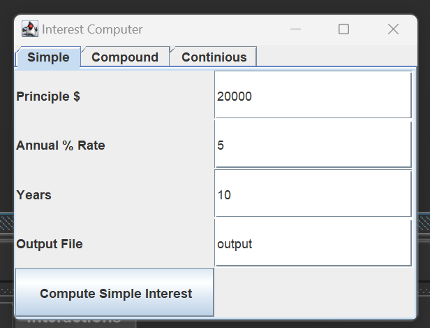
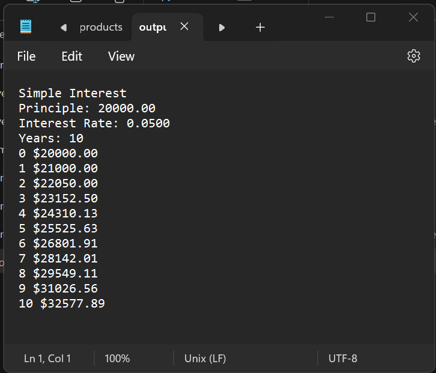
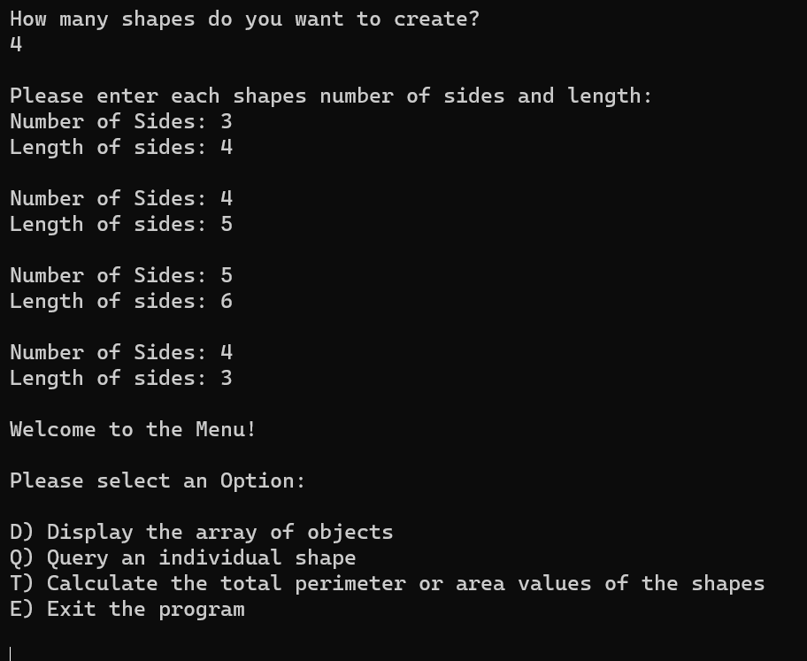
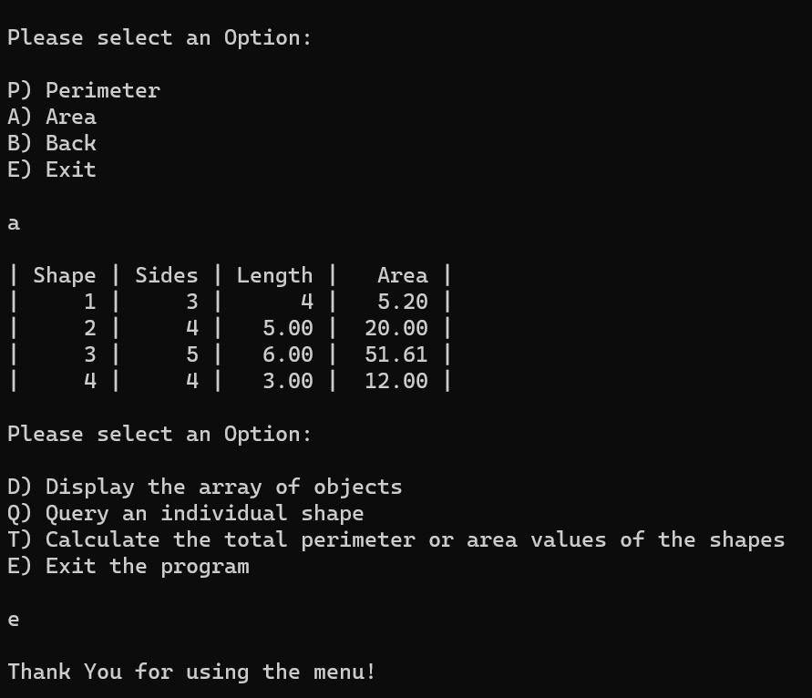

# Coding Projects

[***About Me***](./README.md) | [***Digital Art***](./another-page.md) 

## Interest Calculator

This ***Java Program*** creates an [Interest Calculator](./assets/javaCode/Interest.java) to calculate either a simple, compound, or continious interest. This program requires a [Driver program](./assets/javaCode/Interest.java) to run it. It displays a GUI to obtain the input from the user then outputs the results into an output file.

#### _The dialog box that is prompted once the program starts_

#### _The output file for the user_

* * *

## Evalutating Polygons

This ***C++ Program*** obtains information from the user such as the number of shapes, the number of sides of each shapes, and the side lengths and uses them to calculate what is requested. 

#### _The query and the outer menu for the user_

#### _The inner menu and table results for the user_

