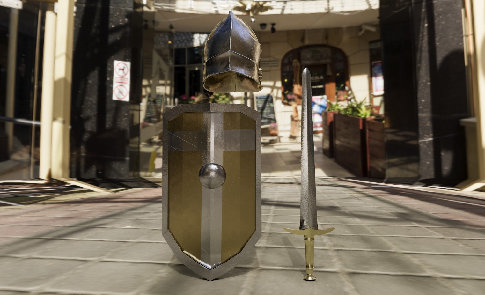

# Digital Art Projects

[***About Me***](./README.md) | [***Coding Projects***](./coding.md)

## General Digital Art Software Experience

***Blender:*** General Understanding of both 2D and 3D Animation, Experience with ***Geometry Nodes, Texturing and Rendering.***

***Autodesk Maya:*** General Understanding of ***3D Animation***, Experience with ***UV Masks, Texturing, and Animating a 3D Character***

***Adobe Programs:*** Decent knowledge of various Adobe Programs such as **Photoshop, Illustrator, Paint Substance, Lightroom, After Effects***

* * *
## 3D Animation

https://github.com/TorresMG/torresmg.github.io/assets/139499918/51d76250-800d-48c8-9b3c-3d5ad20823af

- This project was made using the Autodesk Maya software, the model of the bony character and the objects was not created by me. The animations however were all planned and animated by me.

- This [Landscape Project](./assets/img/Landscape.mp4) was made using the ***Blender*** software and uses various different tools that help bring life to this vibrant animation. The inspiration for this project was from this [video](https://www.youtube.com/watch?v=3p2B6dZIRTY&list=PLNShHVjao84dy-lPJR2fpHzyoses0mCE7) created by Ducky 3D. 

## 3D Texturing using Maya and Adobe Substance Painter
- The gold and silver realistic textures were made with the use of the 3D Modeling and Texturing software of ***Maya*** and ***Adobe Substance Painter***. The models were not made by me but instead were provided by the professor, however all the texturing is original.

#### _Front View of the Helmet_

#### _Front View of the helmet, sword, and shield_

* * *

## Creating a made-up Company's GIF Advertisement
- Created a fake company that specializes in creating unique car designs and created a GIF of an advertisement of this fake company with the use of ***Adobe Programs*** such as ***Photoshop*** and ***Illustrator***.

#### _Final GIF_

* * *
